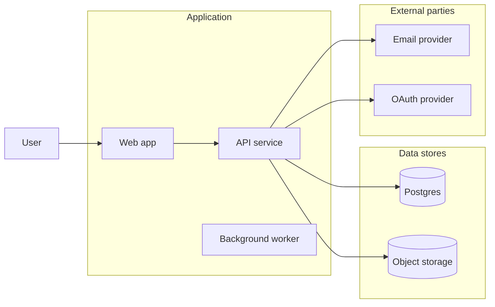

# Architecture Diagrams

Create and maintain Mermaid diagrams that explain how a system works at the right level of abstraction. The diagram should be grounded in code and docs, not invented from vibes.

## When To Use

Use this skill when the user asks for:

- Mermaid architecture diagrams in `README.md`, `architecture.md`, `docs/**`, ADRs, or design docs.
- High-level architecture, low-level design, logical architecture, or conceptual architecture.
- Application dependencies, external parties, service boundaries, data flow, integrations, or use cases.
- Updating stale diagrams after implementation changes.

Do not use this for decorative diagrams, org charts, or non-architecture visuals unless the user asks for Mermaid.

## Diagram Set

Choose the smallest set that answers the documentation need:

| Diagram | Focus | Best Mermaid shape |
|---|---|---|
| Conceptual architecture | Features, capabilities, users, use cases, product areas | `flowchart LR` grouped by user-facing capability |
| Logical architecture | Apps, services, modules, data stores, queues, external parties | `flowchart LR` with subgraphs and boundary labels |
| Low-level design | Components, functions, events, state transitions, feature internals | `sequenceDiagram`, `stateDiagram-v2`, or focused `flowchart TD` |
| Dependency map | Internal packages, APIs, SDKs, external systems | `flowchart LR` with internal/external separation |
| Data flow | How data moves, transforms, persists, and leaves the system | `flowchart TD` or `sequenceDiagram` |

Prefer two diagrams for broad architecture docs:

1. Conceptual: what the product does and which capabilities/use cases exist.
2. Logical: how the application, services, dependencies, stores, and external parties fit together.

Add low-level diagrams only for complex features where a reader needs implementation detail.

## Evidence First

Before editing a diagram:

1. Read the existing architecture docs and README section.
2. Inspect relevant code entry points, packages, services, routes, config, and deployment docs.
3. List confirmed actors, modules, data stores, external systems, and relationships.
4. Mark uncertain relationships as unknown instead of drawing them as fact.
5. Preserve existing doc structure and update diagrams in place when possible.

Use a compact evidence table when useful:

```markdown
| Element | Evidence | Diagram role |
|---|---|---|
| Web app | `apps/web/src/main.tsx` | Frontend client |
| AuroraCloud API | `apps/api/src/server.ts` | Backend service |
| Postgres | `DATABASE_URL`, migrations | Primary data store |
| Resend | `RESEND_API_KEY` | External email provider |
```

## Mermaid Conventions

Use plain Mermaid that renders in GitHub Markdown.

```markdown

```

Guidelines:

- Label boundaries with user-facing names: `Client apps`, `Backend`, `Data stores`, `External parties`.
- Use nouns for nodes and verbs only where an edge label clarifies meaning.
- Prefer readable labels over implementation identifiers unless the doc is low-level.
- Keep diagrams small enough to scan. Split instead of making one dense mega-diagram.
- Use `sequenceDiagram` for request/response or event flows.
- Use `stateDiagram-v2` for lifecycle/status transitions.
- Avoid Mermaid features that GitHub may not render reliably unless the repo already uses them.

## Update Rules

- Update existing diagrams instead of adding duplicates with overlapping meaning.
- If a diagram is conceptual, do not overload it with package names or database tables.
- If a diagram is logical, include relevant external parties and data stores.
- If a diagram is low-level, scope it to one feature, use case, or flow.
- Do not draw dependencies that are only aspirational unless clearly labeled as planned.
- Keep surrounding prose in sync with the diagram.
- If architecture changed materially, consider whether `AGENTS.md`, ADRs, README, or architecture docs also need updates.

## Output Shape

When reporting back, use:

```markdown
| Diagram | Location | Status |
|---|---|---|
| Conceptual architecture | `README.md` | Added feature/use-case view |
| Logical architecture | `docs/architecture.md` | Updated services, stores, external parties |
| Low-level design | Not added | Current change did not need feature-internal flow |
```

End with `Verified:` naming Mermaid rendering checks, markdown checks, or skipped validation.

## Validation

If tooling is available, validate Mermaid with the repo's existing docs tooling or `mmdc`. If no renderer is available:

- Check fenced code blocks are balanced.
- Check Mermaid syntax manually for invalid arrows, duplicate broken node IDs, and unclosed subgraphs.
- Prefer simple node IDs and quoted labels.
- Say diagram rendering was not machine-validated.

If `docs-sweep` or `summary-tables` is available, use them for doc impact and final reporting.
